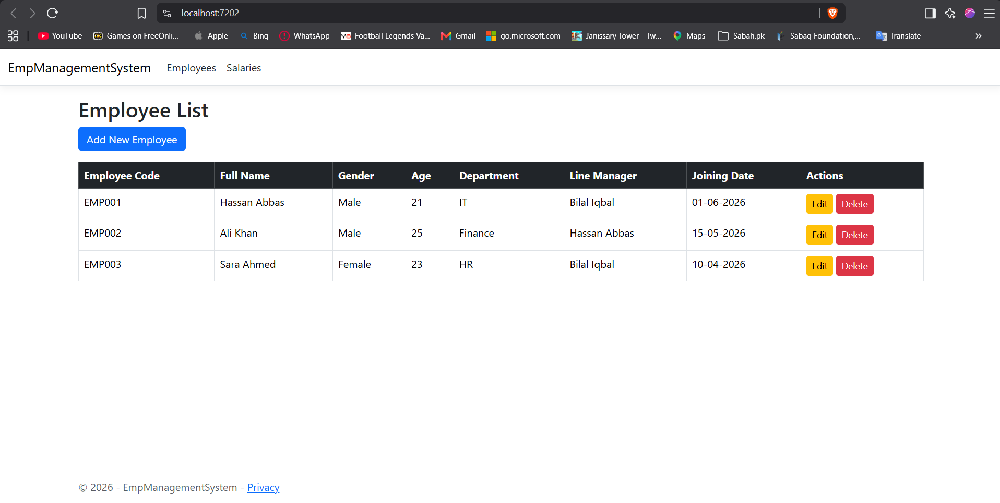
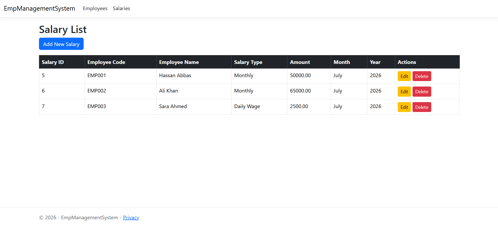
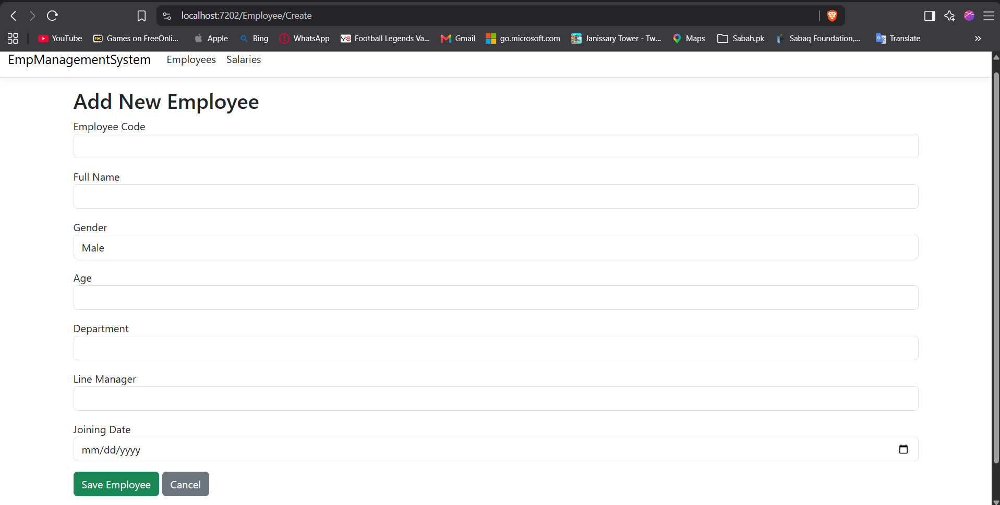
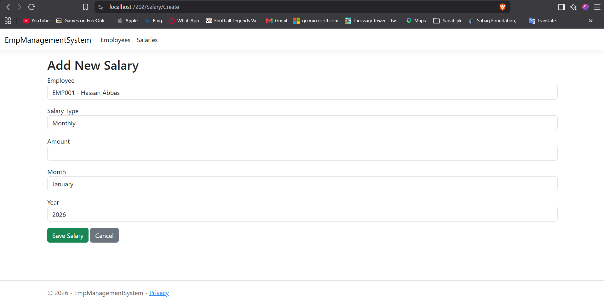
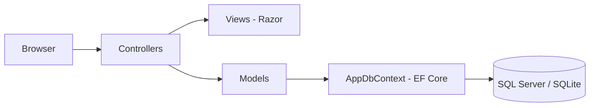

# Employee & Salary Management System


An ASP.NET Core MVC web application for managing employee records and their salary information, built as the capstone project during my Software Development internship at Pakistan Single Window (PSW).

**🔗 Live demo:** https://employee-salary-management-system-5pl5.onrender.com

> ⏳ Hosted on a free-tier server that sleeps after 15 minutes of no visitors. If the link takes ~30–60 seconds to load the first time, that's expected — it's just waking up, not broken. It stays fast after that.

> **Portfolio note:** This is my own final project code, written to demonstrate the concepts covered in the internship (OOP, EF Core, MVC, SQL Server). It contains no PSW company code, proprietary business logic, or company data.

## Screenshots

**Employee List**


**Salary List**


**Add New Employee**


**Add New Salary**


## What It Does

- **Employee management** — add, view, edit, and delete employee records (employee code, full name, gender, age, line manager, department, joining date).
- **Salary management** — record and manage salary entries linked to employees (salary type, amount, month, year), with a dropdown to select the associated employee.
- Full CRUD (Create, Read, Update, Delete) on both entities, following the Model-View-Controller pattern throughout.

## Tech Stack

- **Framework:** ASP.NET Core MVC (.NET 10)
- **ORM:** Entity Framework Core
- **Database:** SQL Server (local/production) or SQLite (free-tier demo — see below)
- **Frontend:** Razor views, Bootstrap, jQuery (client-side validation)
- **Testing:** xUnit, EF Core InMemory provider
- **CI:** GitHub Actions (build + test on every push)
- **Deployment:** Docker, deployed to Render

## Architecture



- **Models** (`Employee`, `Salary`) represent the application's data, with a foreign-key relationship linking each salary record to an employee.
- **Controllers** (`EmployeeController`, `SalaryController`) handle requests and coordinate between the models and views.
- **Views** provide the UI for listing, creating, and editing records.
- **`AppDbContext`** is the bridge between the C# application and the database via Entity Framework Core.

## Database: SQL Server vs. SQLite

The app supports two database backends, switched by the `UseSqlite` setting:

- **Local development:** `appsettings.json` defaults to SQL Server (`UseSqlite: false`) — matches the original PSW internship environment.
- **Live demo (free hosting):** `appsettings.Production.json` sets `UseSqlite: true`, using a lightweight SQLite file instead — no separate database server needed, which is what makes a free live deployment possible. The schema is created automatically on startup via `EnsureCreated()`.

This is a common real-world pattern: a heavier production database locally, a lightweight one for a public demo.

## Tests

```bash
dotnet test EmpManagementSystem.Tests/EmpManagementSystem.Tests.csproj
```

Tests use EF Core's **InMemory** provider, so they run without any real database — each test gets its own isolated in-memory instance. Covers:
- `EmployeeControllerTests` — listing, creating, and deleting employees
- `SalaryControllerTests` — listing salaries with their linked employee (the foreign-key relationship), and creating new salary records

Both test files run automatically on every push via GitHub Actions (see badge above).

## Project Structure

```text
employee-salary-management-system/
├── Controllers/
│   ├── EmployeeController.cs
│   ├── HomeController.cs
│   └── SalaryController.cs
├── Models/
│   ├── AppDbContext.cs
│   ├── Employee.cs
│   ├── Salary.cs
│   └── ErrorViewModel.cs
├── Views/
│   ├── Employee/       # Index, Create, Edit
│   ├── Salary/         # Index, Create, Edit
│   ├── Home/
│   └── Shared/         # Layout, error page
├── EmpManagementSystem.Tests/
│   ├── EmployeeControllerTests.cs
│   └── SalaryControllerTests.cs
├── .github/workflows/build-and-test.yml
├── Dockerfile
├── Program.cs
├── appsettings.json              # local dev (SQL Server)
├── appsettings.Production.json   # free demo (SQLite)
├── EmployeeSalaryManagementSystem.csproj
└── wwwroot/            # Bootstrap, jQuery, site assets
```

## Setup (local development, SQL Server)

### Prerequisites
- .NET 10 SDK
- SQL Server (Express or full) running locally

### 1. Clone
```bash
git clone https://github.com/mhassanabbas/employee-salary-management-system.git
cd employee-salary-management-system
```

### 2. Configure the database connection
Open `appsettings.json` and update the `DefaultConnection` string with your own SQL Server instance name:
```json
"DefaultConnection": "Server=YOUR_SERVER_NAME;Database=EmpDB;Trusted_Connection=True;TrustServerCertificate=True;"
```

### 3. Run the application
```bash
dotnet run
```
The database schema is created automatically on first run. Open the URL shown in the terminal — the app opens directly on the Employee list.

## Deploying your own copy (Docker, free hosting)

This repo includes a `Dockerfile` that builds and runs the app using SQLite, so it can be deployed for free with no separate database server:

1. Push this repo to your own GitHub account.
2. On [Render](https://render.com), create a **New Web Service**, connect the repo — Render auto-detects the `Dockerfile`.
3. Leave Build/Start commands empty (the Dockerfile handles everything). Instance type: Free.
4. Deploy. Once live, copy your URL and add it to the top of this README.

## What I Learned

This project was the integration point for everything covered during the internship:
- **Object-Oriented Programming** — classes, encapsulation, and structuring code around models
- **Entity Framework Core** — Code First development and relationships (one employee → many salary records)
- **ASP.NET Core MVC** — routing, controllers, Razor views, and shared layouts
- **SQL Server** — relational schema design and CRUD operations through an ORM
- **Testing & CI** — writing isolated controller tests with an in-memory database, and automating them with GitHub Actions
- **Containerization & deployment** — packaging a .NET app with Docker and deploying it to free cloud hosting

## Internship Context

Built during my Software Development internship at Pakistan Single Window (PSW), June – August 2026, under the mentorship of Bilal Iqbal Dooply.

## Author

**Hassan Abbas**
BS Information Technology, International Islamic University Islamabad
GitHub: [github.com/mhassanabbas](https://github.com/mhassanabbas)
